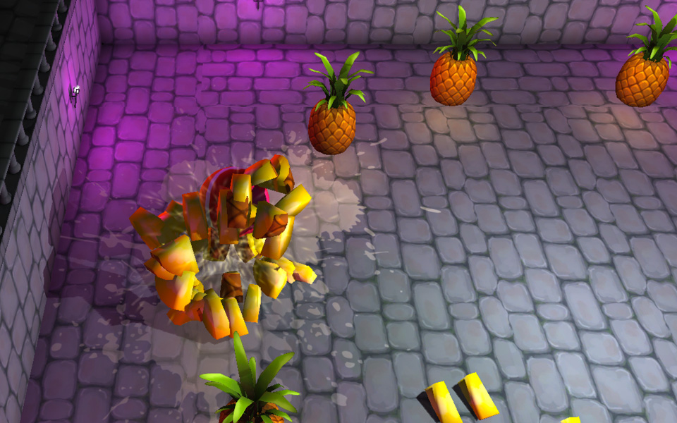

I've always been interested in game development, so I've decided to dedicate some of my time in 2014 to game making.

## Roll a Ball

This game is based on one of the first Unity3D tutorials called "Roll A Ball". I've fleshed it out a bit with custom 3d models, textures, and particle effects.

[Download Mac](http://files.nylira.com/games/nylira-rollaball-mac.zip)
[Download Windows](http://files.nylira.com/games/nylira-rollaball-win.zip)
[Download Linux](http://files.nylira.com/games/nylira-rollaball-linux.zip)
